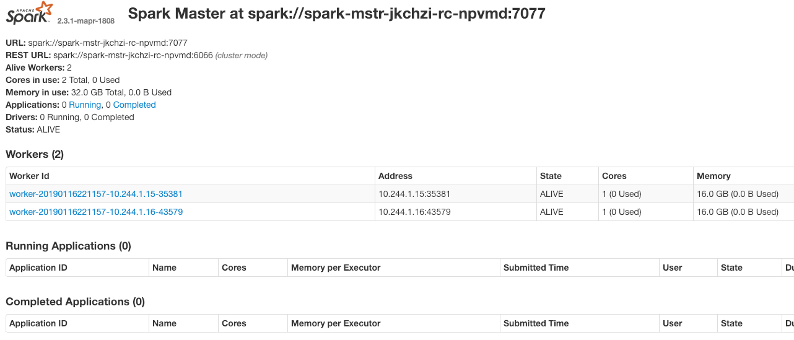

# Deploy standalone Spark cluster on Kubernetes

# Introduction

The artifacts included in this setup will help you deploy a standalone Spark cluster using MapR's packages. Each node on the cluster is configured as a MapR client. There is no data or scripts to go along with the setup (Yet) Once the cluster is up and running  you can get into one of the nodes and run spark-shell or spark-submit with access to maprfs.

# Architecture

Each Spark node will be assigned a location by Kubernetes. This is based on the resources requested and the availability of the resources in your Kubernetes environment. Because we are using a custom Docker image, we need a local registry available to Kubernetes to pull the image. Each node in the Kubernetes cluster has to be able to access the MapR cluster. 

There are some complexities to the Kubernetes networking that I will not address in this document. Make sure you select a Pod network add-on that support communication and DNS resolution between pods/nodes( I am using Flannel).  

>>>>>  gd2md-html alert: inline image link here (to images/Deploy-standalone0.png). Store image on your image server and adjust path/filename if necessary.  (<a href="#">Back to top</a>)(<a href="#gdcalert2">Next alert</a>) >>>>> 

# Requirements

*   Kubernetes installed and working. 
    *   If you need to setup a single node kubernetes cluster you can use this documentation for reference https://drive.google.com/open?id=112qqL8re3Wh0d5G8GaxrlIoyWpOWSIHk8vejyBrjHjA. Note you will need a lot of memory and cpu to run in a single node.  
*   Install a Docker registry that is accessible from all kubernetes nodes.
    *   [https://drive.google.com/open?id=1MuYk7QNyDcdQiyj4N9DUv6SGuuJGBmyOgO3Nlqv4uCM](https://drive.google.com/open?id=1MuYk7QNyDcdQiyj4N9DUv6SGuuJGBmyOgO3Nlqv4uCM)
*   Download the artifacts to the Kubernetes master node
    *   [https://drive.google.com/open?id=18ssYXrRZqtuNY10kO4td7LM6vkp4EZou](https://drive.google.com/open?id=18ssYXrRZqtuNY10kO4td7LM6vkp4EZou)
*   A running Kubernetes Dashboard and connectivity tested from a browser.

# Configuration

Download and extract the artifacts.

## Create and push the Docker image

Under the docker directory you will find the Dockerfile. Create the image following these steps. 

*   cd docker
*   docker build -f mapr-spark:latest .
    *   You can name the image whatever you want

It will take a few minutes to build.

Tag and push to your registry

*   docker tag mapr-spark:latest <registry host>:<registry port>/mapr-spark:latest
*   docker push  <registry host>:<registry port>/mapr-spark:latest

## Configure deployment

To customize the configuration modify the variables in **_setup.sh_**. The file is self documented. At a high level this is what you need to configure:

*   The name of your Docker image
*   Information about the MapR cluster to connect to
    *   Ticket, ssl_truststore, CLDB…

Run **_setup.sh_** to generate the Yaml files

# Deployment

This configuration is meant to explore the Kubernetes functionality along with using MapR packages. Take the time to start components one at a time to make sure that services are operational. 

NOTE: I append a random string to the pod names to facilitate the creation of multiple clusters with the same framework.

## Deploy Spark Master

Deploy

**_kubectl apply -f spark_master.yaml_**

Confirm the pod/container  is running (note the name of the pod)

**_kubectl --namespace=spark-cluster get pods_**

        NAME                         READY     STATUS    RESTARTS   AGE

        **spark-mstr-bydkxg-rc-jmbhq**   1/1       Running   0          1h

Open a command prompt

**kubectl  --namespace=spark-cluster exec -it spark-mstr-bydkxg-rc-jmbhq /bin/bash**

Connect to the Spark UI

[http://localhost:8001/api/v1/namespaces/spark-cluster/services/](http://localhost:8001/api/v1/namespaces/spark-cluster/services/spark-mstr-bydkxg:8080/proxy/)**spark-mstr-bydkxg-rc-jmbhq :8080**/proxy/

NOTE: 

localhost I assume you tunneled to the Kubernetes master node

Make sure you get the pod name correctly

You should get a response from the master, but no worker nodes.  

>>>>>  gd2md-html alert: inline image link here (to images/Deploy-standalone1.png). Store image on your image server and adjust path/filename if necessary.  (<a href="#">Back to top</a>)(<a href="#gdcalert3">Next alert</a>) >>>>> 

## Deploy Spark Workers

Deploy (default config deploys 2 workers)

**_kubectl apply -f spark_worker.yaml_**

Confirm the pod/containers are running 

**_kubectl --namespace=spark-cluster get pods_**

    NAME                         READY     STATUS    RESTARTS   AGE

    spark-mstr-jkchzi-rc-npvmd   1/1       Running   0          2m

    spark-wrkr-jkchzi-rc-488nf   1/1       Running   0          13s

    spark-wrkr-jkchzi-rc-r7k2w   1/1       Running   0          13s

Connect to the Spark UI

After a minute or so, you should see the worker nodes.

>>>>>  gd2md-html alert: inline image link here (to images/Deploy-standalone2.png). Store image on your image server and adjust path/filename if necessary.  (<a href="#">Back to top</a>)(<a href="#gdcalert4">Next alert</a>) >>>>> 

# Use

## Open a command prompt to the master node (You need to get the name of the pod with get pods)

**kubectl  --namespace=spark-cluster exec -it spark-mstr-bydkxg-rc-jmbhq /bin/bash**

## Confirm you are connected to MapR fs

    root@spark-mstr-jkchzi-rc-npvmd:/# /opt/mapr/hadoop/hadoop-2.7.0/bin/hdfs dfs -ls /

    Found 9 items

    drwxr-xr-x   - mapr 5000          4 2019-01-09 21:24 /apps

    drwxr-xr-x   - mapr 5000          0 2018-12-06 21:24 /hbase

    drwxr-xr-x   - mapr 5000          0 2018-12-06 21:36 /opt

    drwxr-xr-x   - mapr 5000          3 2019-01-11 18:12 /podvols

    drwxr-xr-x   - mapr 5000          2 2019-01-09 18:37 /pv

    drwxr-xr-x   - root root          0 2018-12-06 21:36 /tables

    drwxrwxrwx   - mapr 5000          0 2018-12-06 21:24 /tmp

    drwxr-xr-x   - root root          3 2018-12-07 01:12 /user

    drwxr-xr-x   - mapr 5000          1 2018-12-06 21:24 /var

## Run spark-shell

root@spark-mstr-jkchzi-rc-npvmd:/# /opt/mapr/spark/spark-2.3.1/bin/spark-shell     

    Warning: Unable to determine $DRILL_HOME

    2019-01-16 22:19:47 WARN  NativeCodeLoader:62 - Unable to load native-hadoop library for your platform... using builtin-java classes where applicable

    Setting default log level to "WARN".

    To adjust logging level use sc.setLogLevel(newLevel). For SparkR, use setLogLevel(newLevel).

    Spark context Web UI available at http://spark-mstr-jkchzi-rc-npvmd:4040

    Spark context available as 'sc' (master = local[*], app id = local-1547677196049).

    Spark session available as 'spark'.

    Welcome to

          ____              __

         / __/__  ___ _____/ /__

        _\ \/ _ \/ _ `/ __/  '_/

       /___/ .__/\_,_/_/ /_/\_\   version 2.3.1-mapr-1808

          /_/

             

    Using Scala version 2.11.8 (OpenJDK 64-Bit Server VM, Java 1.8.0_191)

    Type in expressions to have them evaluated.

    Type :help for more information.

    scala> 

## Access data with scala	

    scala> val sqlcontext = new org.apache.spark.sql.SQLContext(sc)

    warning: there was one deprecation warning; re-run with -deprecation for details

    sqlcontext: org.apache.spark.sql.SQLContext = org.apache.spark.sql.SQLContext@1b1ea1d9

    scala> val df = sqlcontext.read.json("/podvols/iotdata.json")

    ....

    df: org.apache.spark.sql.DataFrame = [device: string, guid: string ... 7 more fields]

    scala> df.show(1)

    +------+--------------------+------+------+------+--------------+----+-------------------+--------+

    |device|                guid|metric|millis|sensor|      senstype|site|          timestamp|timezone|

    +------+--------------------+------+------+------+--------------+----+-------------------+--------+

    |  dev1|6f3743c6-01e1-4fb...|1000.0|   588| sen/2|currentPresure|  S1|2019-01-11T10:04:03|   -0800|

    +------+--------------------+------+------+------+--------------+----+-------------------+--------+

    only showing top 1 row

    scala> 

# Delete deployment

The easiest way to remove all artifacts is to run

**_kubectl delete namespace spark-cluster_**

Change the namespace if you changed it in the setup.

# Other fun stuff

## Scale workers

Do you need more power? Add more workers…

Get the name of the worker replication controller. In this example it has 2 replicas running (2 Spark worker nodes)

    **kubectl --namespace=spark-cluster get rc**

    NAME                   DESIRED   CURRENT   READY     AGE

    spark-mstr-jkchzi-rc   1         1         1         11m

    **spark-wrkr-jkchzi-rc**   2         2         2         2m

Add replicas (worker node). 

    **kubectl --namespace=spark-cluster scale --current-replicas=2 --replicas=3 rc/spark-wrkr-jkchzi-rc**

    replicationcontroller "spark-wrkr-jkchzi-rc" scaled

You should now see one more worker node

**kubectl --namespace=spark-cluster get rc**

NAME                   DESIRED   CURRENT   READY     AGE

spark-mstr-jkchzi-rc   1         1         1         18m

spark-wrkr-jkchzi-rc   3         3         3         9m

>>>>>  gd2md-html alert: inline image link here (to images/Deploy-standalone3.png). Store image on your image server and adjust path/filename if necessary.  (<a href="#">Back to top</a>)(<a href="#gdcalert5">Next alert</a>) >>>>> 

References

Install cluster with Kubeadm

https://kubernetes.io/docs/setup/independent/install-kubeadm/

https://kubernetes.io/docs/setup/independent/create-cluster-kubeadm/

<!-- Docs to Markdown version 1.0β14 -->

